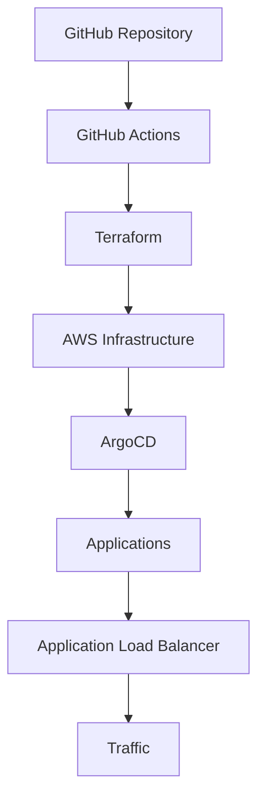
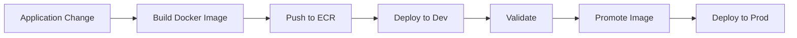

# gitops-platform-project# Production-Style GitOps Platform on AWS

## Overview

This project is a production-style multi-environment GitOps platform built on AWS, designed to model real-world infrastructure delivery patterns across development and production environments.

It combines:

- **Terraform** for infrastructure provisioning
- **Amazon EKS** for Kubernetes orchestration
- **ArgoCD** for GitOps-based application delivery
- **Helm** for packaging Kubernetes applications
- **GitHub Actions** for CI/CD orchestration
- **Amazon ECR** for container image storage
- **AWS Load Balancer Controller (IRSA-enabled)** for Kubernetes ingress management

The platform supports:

✅ Multi-environment deployments (**dev / prod**)  
✅ Multi-region infrastructure (**us-east-1 / eu-west-1**)  
✅ Fully automated provisioning workflows  
✅ Manual production promotion workflow  
✅ Automated teardown / destroy orchestration  
✅ Secure dynamic Kubernetes API access for CI runners  
✅ Modular infrastructure design

---

## Architecture



---

## Environment Topology

### Development

- Region: `us-east-1`
- VPC CIDR: `10.0.0.0/16`
- Node group:
  - `t3.small`
  - 2 nodes
- Used for:
  - infrastructure validation
  - application validation
  - deployment verification

### Production

- Region: `eu-west-1`
- VPC CIDR: `10.1.0.0/16`
- Node group:
  - `t3.large`
  - 2 nodes
- Used for:
  - promoted validated releases
  - production-grade workload sizing

---

## Infrastructure Layout

Infrastructure is intentionally split into separate Terraform roots:

```text
network
→ cluster
→ platform
→ bootstrap
```

This separation keeps lifecycle boundaries clean and avoids tightly coupled infrastructure teardown problems.

### 1) Network

Responsible for:

- VPC
- Public subnets
- Private subnets
- Internet Gateway
- NAT Gateway
- Route tables
- Network tagging for Kubernetes integrations

### 2) Cluster

Responsible for:

- EKS cluster
- Managed node groups
- OIDC provider
- IAM roles
- IRSA setup
- AWS Load Balancer Controller values generation

### 3) Platform

Responsible for:

- ArgoCD installation via Helm

### 4) Bootstrap

Responsible for:

- Root ArgoCD Application
- App-of-Apps GitOps bootstrap

---

## GitOps Model

ArgoCD follows an **App-of-Apps** architecture.

Root application:

```text
root-app
```

Manages child applications:

### Development

```text
aws-load-balancer-controller-dev
aws-load-balancer-controller-sa-dev
demo-app-dev
```

### Production

```text
aws-load-balancer-controller-prod
aws-load-balancer-controller-sa-prod
demo-app-prod
```

This enables environment-specific reconciliation while keeping application definitions declarative.

---

## CI/CD Flow

## Application Delivery



### Dev deployment

Application image is built and pushed automatically.

Development environment is updated automatically.

### Production deployment

Production is intentionally **manual promotion only**.

Promotion workflow:

- Reads deployed image tag from:

```text
gitops/apps/demo-app/values-dev.yaml
```

- Updates:

```text
gitops/apps/demo-app/values-prod.yaml
```

- Commits promotion to Git

ArgoCD then reconciles production automatically.

This creates a clean:

**validate in dev → promote → deploy prod**

delivery model.

---

## Secure Cluster API Access

EKS API access is restricted dynamically.

GitHub Actions runner public IP is detected at runtime:

```bash
curl https://checkip.amazonaws.com
```

Terraform receives:

```text
runner-ip/32
```

for Kubernetes API access.

This means:

✅ no static allowlists  
✅ no open API endpoint  
✅ CI-only access window  
✅ reduced attack surface

---

## AWS Load Balancer Controller

The platform deploys AWS Load Balancer Controller using:

- IRSA
- generated environment-specific values
- ArgoCD-managed Helm deployment

Terraform generates:

```text
gitops/infrastructure/alb-controller/values-dev.yaml
gitops/infrastructure/alb-controller/values-prod.yaml
```

Generated values include:

- cluster name
- region
- VPC ID
- IAM role ARN

This avoids hardcoding environment-specific cloud identifiers inside GitOps manifests.

---

## Automated Destroy Workflow

The project supports full automated teardown:

```text
bootstrap destroy
→ platform destroy
→ cluster destroy
→ network destroy
```

Cleanup includes:

- ArgoCD child application deletion
- graceful Kubernetes resource cleanup
- ALB dependency wait handling
- leftover security group cleanup
- destroy retries for AWS eventual consistency edge cases

Operational diagnostics are logged throughout destroy flows for easier troubleshooting.

This makes the platform fully lifecycle-managed:

**create → operate → destroy**

---

## Repository Structure

```text
.
├── app/
├── gitops/
│   ├── applications/
│   │   ├── dev/
│   │   └── prod/
│   ├── apps/
│   │   └── demo-app/
│   └── infrastructure/
│       └── alb-controller/
├── infra/
│   ├── bootstrap/
│   ├── environments/
│   │   ├── dev/
│   │   └── prod/
│   └── modules/
│       ├── compute/
│       ├── network/
│       ├── platform/
│       └── security/
└── scripts/
```

---

## Key Design Decisions

### Modular Terraform

Reusable modules:

- network
- compute
- security
- platform

Environment roots consume modules declaratively.

---

### App-of-Apps GitOps

Separates:

- platform provisioning
- application reconciliation

This keeps cluster bootstrap deterministic.

---

### Generated Environment Values

Cloud identifiers are generated automatically rather than manually maintained.

Reduces configuration drift.

---

### Manual Production Promotion

Production deployment requires deliberate promotion.

This preserves release control while keeping deployment automated.

---

## Highlights

- Multi-environment GitOps platform
- Multi-region AWS deployment model
- Modular Terraform architecture
- IRSA-based AWS integrations
- Automated CI/CD pipelines
- Controlled production promotion
- Fully automated infrastructure teardown
- Production-style operational workflow design

---

## Tech Stack

- AWS
- Terraform
- Amazon EKS
- ArgoCD
- Helm
- GitHub Actions
- Docker
- Amazon ECR
- Kubernetes
- IAM / IRSA

---